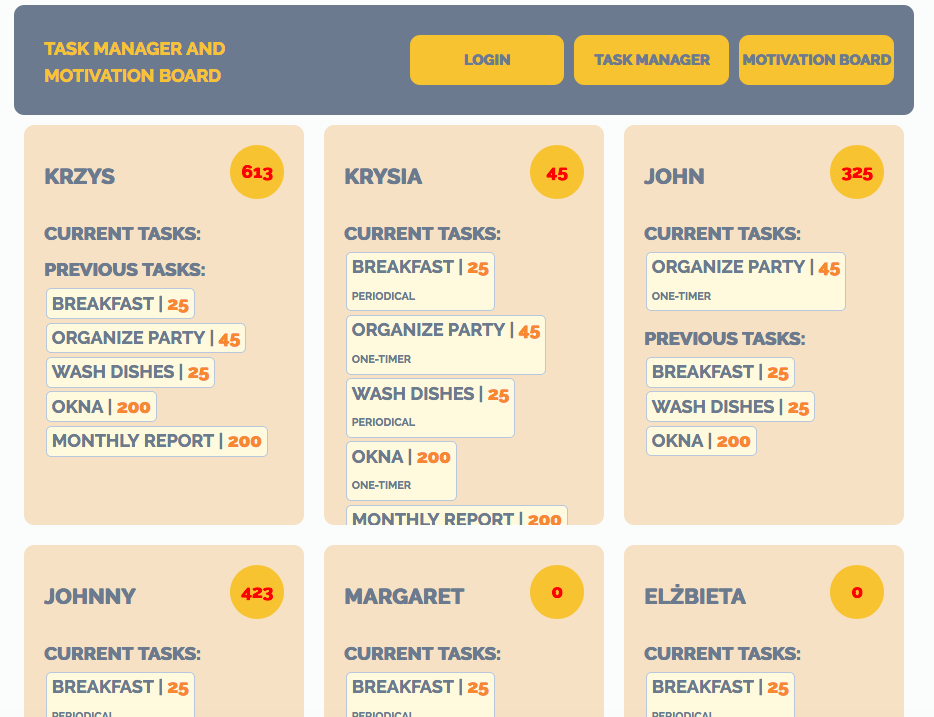

# Task Manager and Motivation Board

It's an app for motivating workers. The boss ('admin') assigns tasks to his/her workers. Completion of each task is awarded with points.

The App is written in ReactJS, developped with webpack.

(It is my final project for a front-end bootcamp.)

## Installation

Clone or download the project repository. Go to the project folder, and install the necessary npm packages:

`npm install`

Install [json-server](https://github.com/typicode/json-server) (install it globally). And serve the database: go to the `/db` directory, and run:

`json-server people.json`

The server will serve the json file on `localhost:3000`.

(You can change the port by launching server with `json-server -p 4000 people.json`)

Next open a new Terminal window and go to the project directory and run:

`webpack-dev-server`

The webpack server will serve the project on `localhost:3001`. So open your browser and go to `localhost:3001`.

!!! It is preferable to use Chrome. The project uses certain functionalities that don't work properly on other browsers.

### Functionnalities

To use the App you have to login or register.

If you're logged in as a worker ('user'), you can see the overall motivation board of all other workers:

And you can manage your own tasks (mark their completion or cancel):

If you're logged in as admin, in the overall motivation board you have the possibility of assining tasks to your workers:

And you can also manage the general task bank (add new tasks):

## Automatic task refresh

The funny functionnality (and one that was a bit tricky to implement) are periodic tasks. The admin can assign a periodic task to one of his/her workers. The admin precises if the task should be refreshed weekly (default) or monthly, and the start date (default today).

Let's suppose the worker has a weekly task (once a week refill the coffee machine), assigned on Tuesday, 12th of September. He/she has a week from tuesday the 12th to do it. If the worker completes the task before tuesday 13th, upon login on 13th or any subsequent day, he/she will find that task on his/her current tasks.

Of course, the worker can also cancel the task (just for that week, or completely). 

[For the moment, the app awaits with the refreshment of the task until the first week/month terminates. A fix is required for the futher refreshment to work also on weekly/monthly basis.]